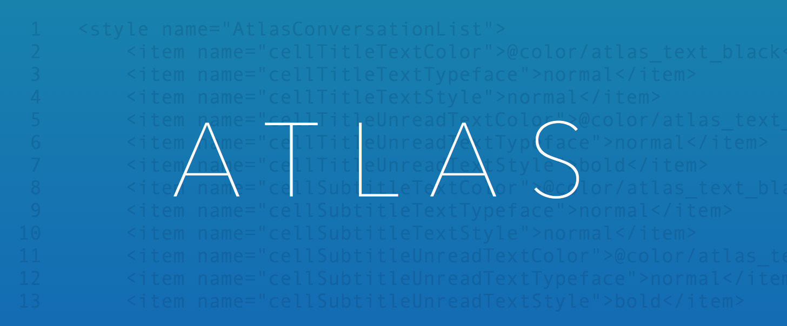
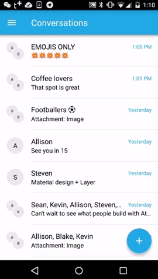

##<a name="overview"></a>Preview Release Overview
Atlas is an open source framework of customizable UI components for use with the Layer SDK designed to get messaging tested and integrated quickly.  This repository contains the Atlas library as well as an example app.

Note: Atlas for Android is currently a **Preview Release**. This repository will be updated substantially in the coming weeks.



###<a name="example_app"></a>Example App
The Atlas example app is located in the `layer-atlas-messenger` directory.

* **QR Code:**  To get started as fast as possible, launch the app and scan your Layer Atlas QR code.  If you need a free account, get it at <a href="https://getatlas.layer.com/">getatlas.layer.com</a>.
* **App ID:** If you already have a Layer App ID, you can bypass the QR code by entering your App ID in <a href="layer-atlas-messenger/src/main/java/com/layer/atlas/messenger/MessengerApp.java#L42">MessengerApp</a> before building, in `LAYER_APP_ID`.

###<a name="api_quickstart"></a>API Quickstart
The Atlas library is located in the `layer-atlas` directory.  The table below details the most important classes in Atlas and is hyperlinked directly to the current java file.

<table>
    <tr><th colspan="2" style="text-align:center;">Views</th></tr>
    <tr>
        <td><a href="layer-atlas/src/main/java/com/layer/atlas/AtlasConversationsList.java">AtlasConversationsList</a></td>
        <td>A list of Conversations</td>
    </tr>
    <tr>
        <td><a href="layer-atlas/src/main/java/com/layer/atlas/AtlasMessagesList.java">AtlasMessagesList</a></td>
        <td>A list of Messages</td>
    </tr>
    <tr>
        <td><a href="layer-atlas/src/main/java/com/layer/atlas/AtlasMessageComposer.java">AtlasMessageComposer</a></td>
        <td>A View used to compose and send Messages</td>
    </tr>
    <tr>
        <td><a href="layer-atlas/src/main/java/com/layer/atlas/AtlasParticipantPicker.java">AtlasParticipantPicker</a></td>
        <td>Participant selection with dynamic filtering</td>
    </tr>
    <tr>
        <td><a href="layer-atlas/src/main/java/com/layer/atlas/AtlasTypingIndicator.java">AtlasTypingIndicator</a></td>
        <td>Displays TypingIndicator information for a Conversation</td>
    </tr>
    <tr><th colspan="2" style="text-align:center;">Interfaces</th></tr>
    <tr>
        <td><a href="layer-atlas/src/main/java/com/layer/atlas/Atlas.java#L130">Participant</a></td>
        <td>Allows Atlas classes to render Participant information</td>
    </tr>
    <tr>
        <td><a href="layer-atlas/src/main/java/com/layer/atlas/Atlas.java#L149">ParticipantProvider</a></td>
        <td>Provides Atlas classes with Participants</td>
    </tr>
</table>

##<a name="installation"></a>Installation
See the <a href="INSTALLATION.md">installation guide</a>

##<a name="component_details"></a>Component Details
Atlas is divided into five basic `View` components.

###AtlasConversationsList
The `AtlasConversationList` is a list of Conversations. 

```xml
<com.layer.atlas.AtlasConversationsList
    android:id="@+id/conversations_list"
    android:layout_width="match_parent"
    android:layout_height="match_parent"
    />
```

```java
conversationsList = (AtlasConversationsList) findViewById(R.id.conversations_list);
conversationsList.init(conversationsList, layerClient, participantProvider);
conversationsList.setClickListener(new ConversationClickListener() {
	public void onItemClick(Conversation conversation) {
		openChatScreen(conversation, false);
	}
});
```

###AtlasMessagesList
The `AtlasMessageList` is list of Messages, rendered as Cells.

```xml
<com.layer.atlas.AtlasMessagesList
    android:id="@+id/messages_list"
    android:layout_width="match_parent"
    android:layout_height="match_parent"
    />
```

```java
messagesList = (AtlasMessagesList) findViewById(R.id.messages_list);
messagesList.init(layerClient, participantProvider);
messagesList.setConversation(conversation);
messagesList.setItemClickListener(new ItemClickListener() {
	public void onItemClick(Cell item) {
		if (Atlas.MIME_TYPE_ATLAS_LOCATION.equals(item.messagePart.getMimeType())) {
       	String jsonLonLat = new String(item.messagePart.getData());
       	/* launch map app */
		}
	}
});
```

###AtlasMessageComposer
The `AtlasMessageComposer` is a set of buttons and a text entry area for composing messages. 

```xml
<com.layer.atlas.AtlasMessageComposer
    android:id="@+id/message_composer"
    android:layout_width="match_parent"
    android:layout_height="wrap_content"
    />
```

```java
AtlasMessageComposer messageComposer = (AtlasMessageComposer) findViewById(R.id.message_composer);
messageComposer.init(layerClient, conversation);
messageComposer.setListener(new AtlasMessageComposer.Listener() {
	public boolean beforeSend(Message message) {
		if (conversation == null) {
			// create new one
			conversation = layerClient.newConversation(participantsPicker.getSelectedUserIds());
			messageComposer.setConversation(conversation);
		}

		// push
		Map<String, String> metadata = new HashMap<String, String>();
		String text = senderName + ": " + new String(message.getMessageParts().get(0).getData());
		metadata.put(Message.ReservedMetadataKeys.PushNotificationAlertMessageKey.getKey(), text);
		message.setMetadata(metadata);
		return true;
	}
});

messageComposer.registerMenuItem("Image", new OnClickListener() {
	public void onClick(View v) {
		Intent intent = new Intent().setType("image/*").setAction(Intent.ACTION_GET_CONTENT);
		startActivityForResult(Intent.createChooser(intent, "Select Picture"), REQUEST_CODE_GALLERY);
	}
});
```

###AtlasParticipantPicker
The `AtlasParticipantPicker` allows the user to search and select one or more participants.

```xml
<com.layer.atlas.AtlasParticipantPicker
    android:id="@+id/participant_picker"
    android:layout_width="match_parent"
    android:layout_height="match_parent"
    />
```

```java
AtlasParticipantPicker participantsPicker = (AtlasParticipantPicker) findViewById(R.id.participant_picker);
participantsPicker.init(userIdsToSkip, participantProvider);
```

###AtlasTypingIndicator
The `AtlasTypingIndicator` presents the user with active typers.

```xml
<com.layer.atlas.AtlasTypingIndicator
    android:id="@+id/typing_indicator"
    android:layout_width="wrap_content"
    android:layout_height="wrap_content"
    />
```

```java
typingIndicator = (AtlasTypingIndicator) findViewById(R.id.typing_indicator);
typingIndicator.init(conv, new AtlasTypingIndicator.DefaultTypingIndicatorCallback(participantProvider));
```

##<a name="styling"></a>Styling
Atlas allows you to quickly style its components through code, layouts, and themes.  For a complete list of stylable component attributes, see <a href="layer-atlas/src/main/res/values/atlas-styles.xml">atlas-styles.xml</a>

<!--**Dynamically adjust View styles through code (coming soon):**

```java
	AtlasMessageList messageList = (AtlasMessageList) findViewById(R.id.messageList);
	messageList.setMyBubbleColor(Color.YELLOW);
```
-->
**Set attributes on individual views within your layouts:**

```xml
<?xml version="1.0" encoding="utf-8"?>
<LinearLayout xmlns:android="http://schemas.android.com/apk/res/android"
              xmlns:atlas="http://schemas.android.com/apk/res-auto"
              android:layout_width="match_parent"
              android:layout_height="match_parent"
              android:orientation="vertical">

    <com.layer.atlas.AtlasMessagesList
        android:layout_width="match_parent"
        android:layout_height="match_parent"
        atlas:myBubbleColor="#FF0"
        />

</LinearLayout>
```

**Customize the global Atlas theme from your `styles.xml`:**

```xml
<?xml version="1.0" encoding="utf-8"?>
<resources>

    <style name="AppTheme" parent="Theme.Atlas.Light">
        <item name="AtlasMessageList">@style/CustomAtlasMessageList</item>
    </style>

    <style name="CustomAtlasMessageList" parent="AtlasMessageList">
        <item name="myBubbleColor">#FF0</item>
    </style>
    
</resources>
```

##<a name="contributing"></a>Contributing
Atlas is an Open Source project maintained by Layer. Feedback and contributions are always welcome and the maintainers try to process patches as quickly as possible. Feel free to open up a Pull Request or Issue on Github.

##<a name="license"></a>License

Atlas is licensed under the terms of the [Apache License, version 2.0](http://www.apache.org/licenses/LICENSE-2.0.html). Please see the [LICENSE](LICENSE) file for full details.

##<a name="contact"></a>Contact

Atlas was developed in San Francisco by the Layer team. If you have any technical questions or concerns about this project feel free to reach out to [Layer Support](mailto:support@layer.com).

##<a name="credits"></a>Credits

* [Oleg Orlov](https://github.com/oorlov)
* [Steven Jones](https://github.com/sjones94549)